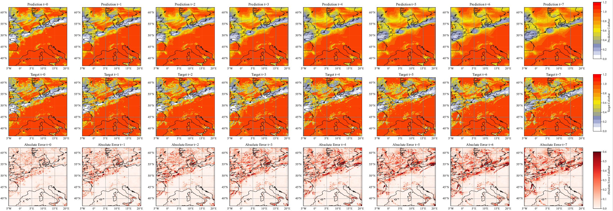
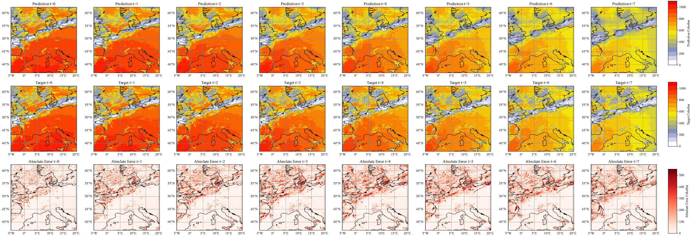

<div align="center">

# **Solar deterministic forecasting famework based on deep learning models**
[](https://github.com/pre-commit/pre-commit)
[](https://pytorch.org/get-started/locally/)
[](https://pytorchlightning.ai/)
[](https://hydra.cc/) 
</div>

A deep learning code library based on Pytorch Lightning for solar irradiance prediction.
This deterministic solar irradiance prediction codes library was developed to contribute a bit to the field. I'll be maintaining the main branch on a regular basis.
## Satellite derived solar irradiance data
You guys can download regional solar irradiance data throught [CM SAF](https://wui.cmsaf.eu/safira/action/viewProduktSearch).

## Models
So far, the code library includes five deep learning models.
-  **PredRNN** - [PredRNN: Recurrent Neural Networks for Predictive Learning using Spatiotemporal LSTMs](https://papers.nips.cc/paper_files/paper/2017/file/e5f6ad6ce374177eef023bf5d0c018b6-Paper.pdf)
-  **MIM** - [Memory In Memory: A Predictive Neural Network for Learning Higher-Order Non-Stationarity from Spatiotemporal Dynamics](https://arxiv.org/pdf/1811.07490)
-  **MAU** - [MAU: A Motion-Aware Unit for Video Prediction and Beyond](https://proceedings.neurips.cc/paper_files/paper/2021/file/e25cfa90f04351958216f97e3efdabe9-Paper.pdf)
-  **E3DLSTM** - [Eidetic 3D LSTM: A Model for Video Prediction and Beyond](https://openreview.net/pdf?id=B1lKS2AqtX)
-  **ConvLSTM** - [Convolutional LSTM Network: A Machine Learning Approach for Precipitation Nowcasting](https://arxiv.org/abs/1506.04214)

## Training process
The pytorch modules required for the model must be installed before starting to train the model, detailed versions can be found in requirements.txt. After the requirements for model training have been met, all the files in configs need to be configured.
After completing the configuration of the relevant models, you just need to replace the relevant .yaml paths in the run.py file or launch:
```bash
python run.py --config-name=model name
```
## ConvLSTM forecasting results 
### Prediction target - Clear Sky Index
<div align="center">

</div>

### Prediction target - SSI
<div align="center">

</div>

## Contributors ✨

Thanks goes to these wonderful people ([emoji key](https://allcontributors.org/docs/en/emoji-key)):

<!-- ALL-CONTRIBUTORS-LIST:START - Do not remove or modify this section -->
<!-- prettier-ignore-start -->
<!-- markdownlint-disable -->
<table>
  <tbody>
    <tr>
      <td align="center"><a href="https://jotyjt.github.io/"><br /><sub><b>Joty</b></sub></a><br /><a href="JOTYtao" title="Code">💻</a></td>
    </tr>
  </tbody>
</table>

<!-- markdownlint-restore -->
<!-- prettier-ignore-end -->

<!-- ALL-CONTRIBUTORS-LIST:END -->

This project follows the [all-contributors](https://github.com/all-contributors/all-contributors) specification. Contributions of any kind welcome!
